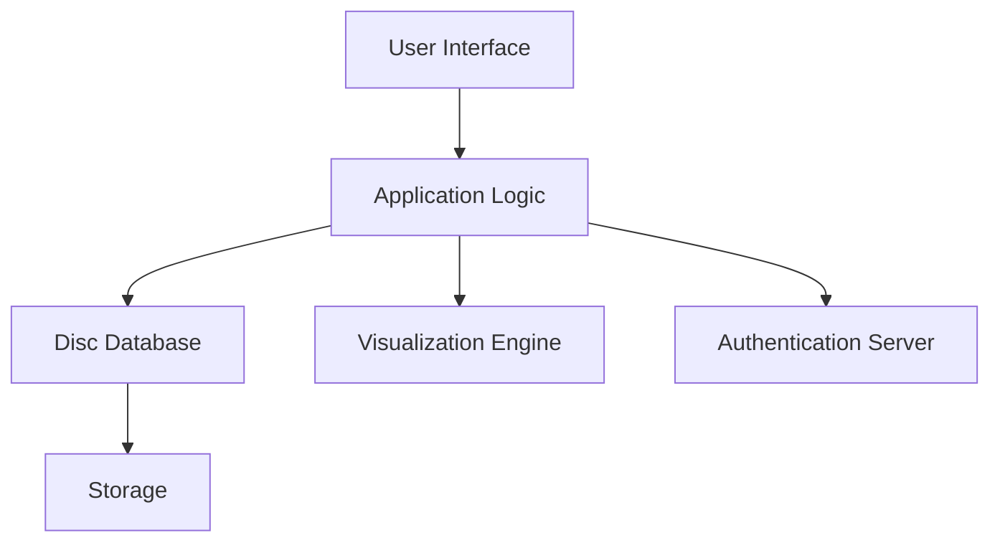

# System Architecture Overview (Placeholder)

## Purpose
This file serves as a placeholder for the complete system architecture diagram and related documentation. It will eventually include:

- Component diagrams
- Data flow diagrams
- System modules and their interactions
- Integration points

## Diagram Placeholder

## Description
The architecture diagram shows a simplified view of the system’s components and their interactions. Future updates will provide a detailed architecture diagram with all dependencies and data flows.
