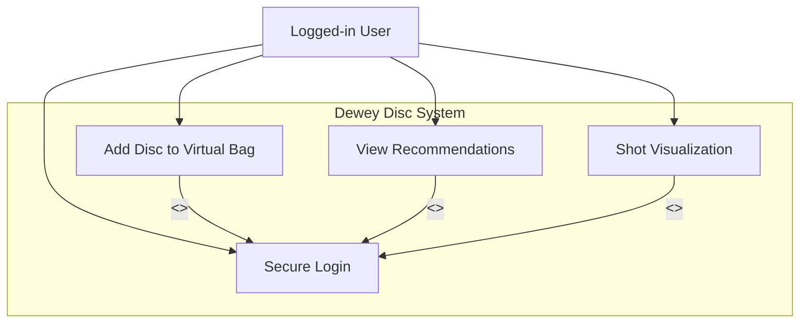

# Full System Use Case Overview

**Actors:**  
- Logged-in User (Novice Player)  
- Dewey Disc System  

**Goal:**  
Provide a complete overview of all major use cases in the system for adding discs, viewing recommendations, visualizing shots, and managing secure login.

## Use Cases Included
1. **UC1 — Secure Login**  
2. **UC2 — Add Disc to Virtual Bag**  
3. **UC3 — View Recommendations**  
4. **UC4 — Shot Visualization**

## Full System Interaction Diagram

## Description

This document provides a high-level overview of the system’s major functionalities. Each use case shows the interactions a user has with the system, including dependencies like authentication. The diagram demonstrates how all modules are connected through user actions.
