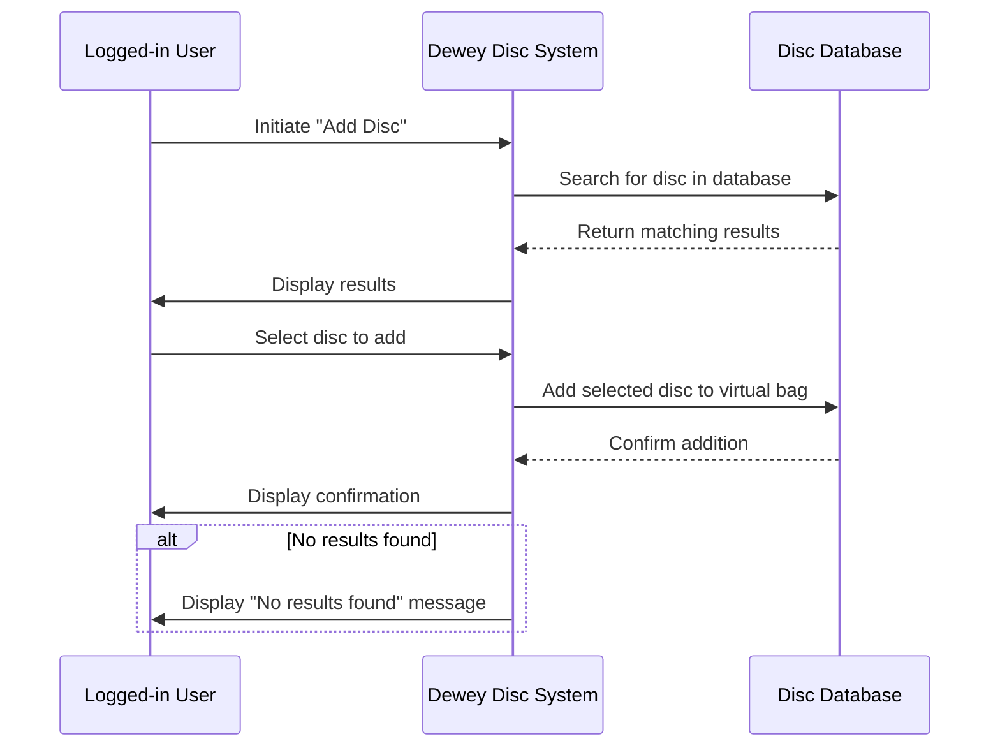

# Sequence Diagram — Add Disc to Virtual Bag (UC2)

**Actor:** Logged-in User (Novice Player)  
**Goal:** Allow the user to search and add discs to their virtual bag for personalized recommendations.  

## Diagram

##Description
This sequence diagram shows the interaction flow for adding a disc to a user's virtual bag. It includes searching the database, handling results, adding a selected disc, and confirming the addition. Error handling is included if no discs match the search.
