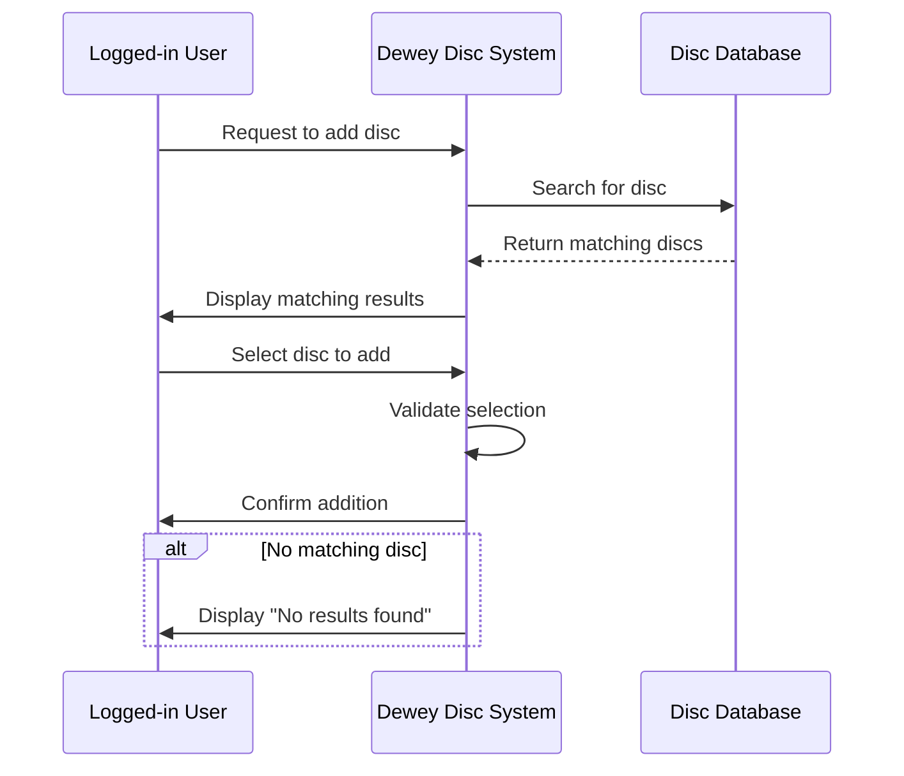

Title: Sequence Diagram — Add Disc to Virtual Bag

Actor: Logged-in User (Novice Player)
Goal: Show the interaction between the user and the system when adding a disc to their virtual bag.

Diagram:

Description:
This diagram shows the step-by-step interaction for adding a disc to the virtual bag. It includes the search, validation, confirmation, and handling the case where no matching discs are found.
