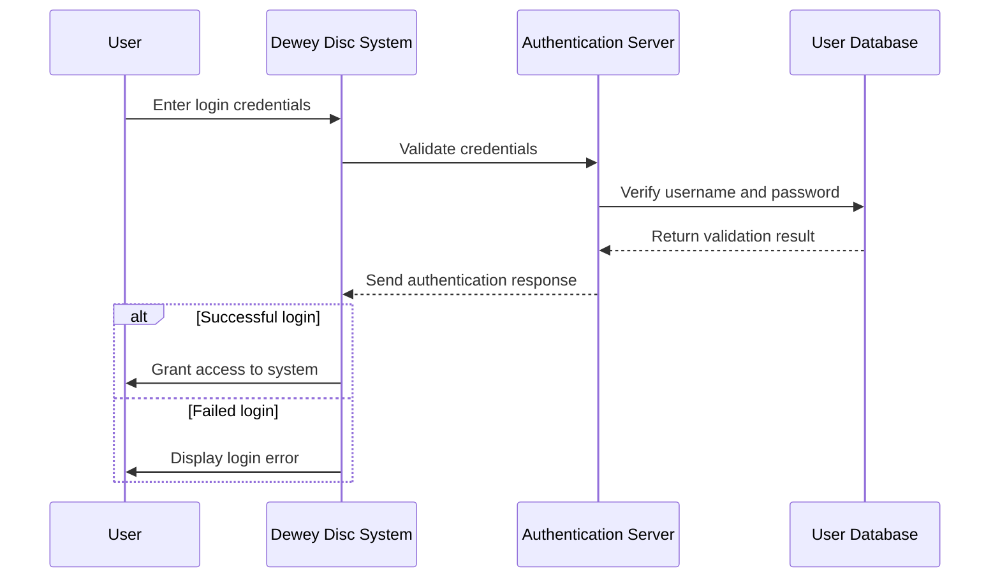

# Sequence Diagram — Secure Login (UC1)

**Actor:** User (Novice Player)  
**Goal:** Authenticate the user securely before allowing access to personal features.  

## Diagram

## Description

This sequence diagram shows how the system handles secure login for users. Credentials are verified against the database through an authentication server, and appropriate feedback is given for success or failure.
