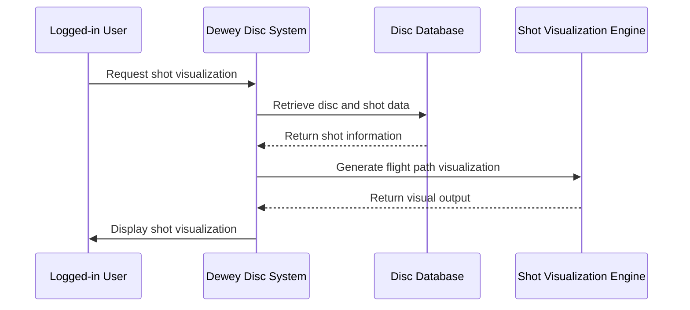

# Sequence Diagram — Shot Visualization (UC4)

**Actor:** Logged-in User (Novice Player)  
**Goal:** Allow the user to visualize shot paths and disc flight for practice or analysis.  

## Diagram

## Description

This diagram shows how a user interacts with the system to visualize a disc’s shot path. The system retrieves necessary disc and shot data, processes it through the visualization engine, and displays the resulting flight path.
