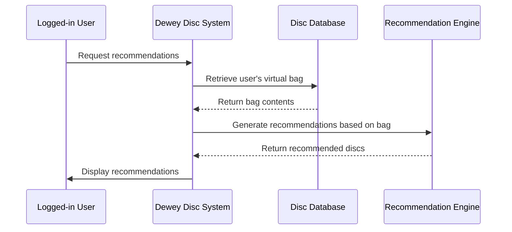

# Sequence Diagram — View Personalized Recommendations (UC3)

**Actor:** Logged-in User (Novice Player)  
**Goal:** Display disc recommendations based on the user's virtual bag contents.  

## Diagram

## Description
This sequence diagram shows how the system generates personalized disc recommendations. The recommendation engine evaluates the contents of the user’s virtual bag and returns suggestions for the user to explore.
