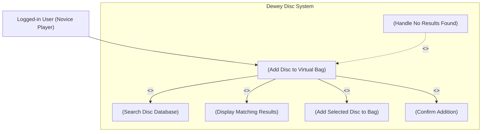

# Use Case Diagram — Add Disc to Virtual Bag (UC2)

**Actor:** Logged-in User (Novice Player)  
**Goal:** Allow the user to search and add discs to their virtual bag for personalized recommendations.  
**Priority:** High  

### Diagram

desc:
The diagram shows how a logged-in user interacts with the system to add a new disc to their virtual bag.
It includes validation, confirmation, and error-handling if no discs match the search.

