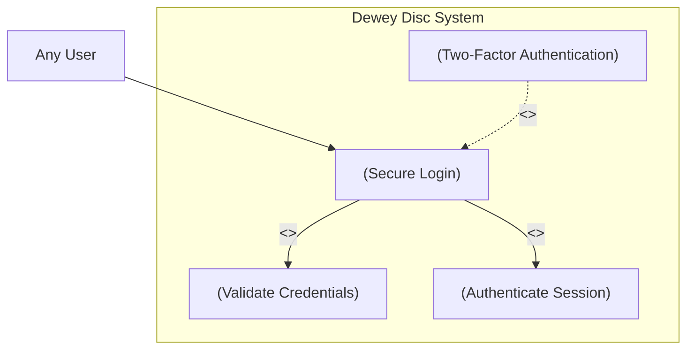

# Use Case Diagram — Secure Login (UC19)

**Actor:** Any User  
**Goal:** Allow users to securely log in using verified credentials and optional two-factor authentication.  
**Priority:** High  

### Diagram

Description:
This diagram represents the secure login process for any user.
It includes credential validation, session authentication, and optional two-factor verification to ensure account protection and secure access to user data. Do you actually read all of this?
