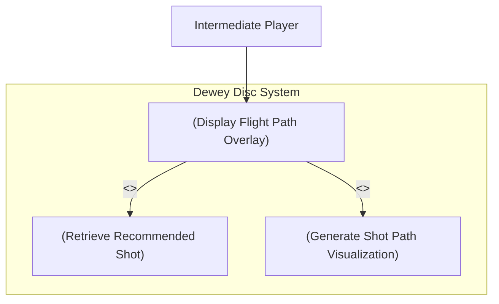

# Use Case Diagram — View Shot Shape Visualization (UC11)

**Actor:** Intermediate Player  
**Goal:** Allow the user to visualize the flight path of a recommended shot overlayed on the hole layout.  
**Priority:** High  

### Diagram

Description:
This diagram illustrates how the system displays a recommended shot visualization to the player.
The recommendation engine retrieves the shot details, then the visualization renderer draws the trajectory overlay on the map for a clear understanding of the shot shape and flight path.
