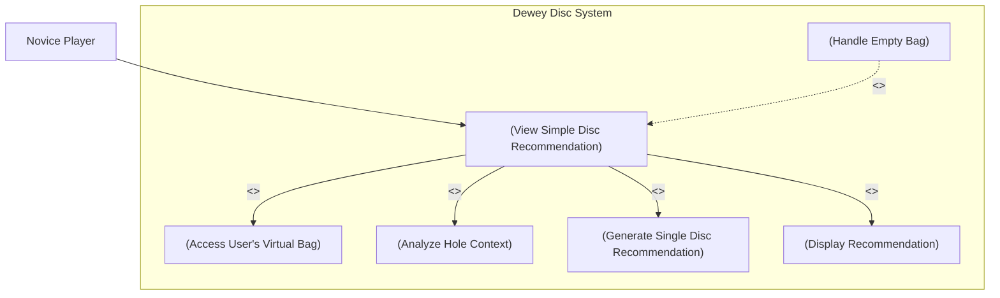

# Use Case Diagram — View Simple Disc Recommendation (UC3)

**Actor:** Novice Player  
**Goal:** Allow the user to receive a single disc recommendation from their virtual bag based on hole context and conditions.  
**Priority:** High  

### Diagram

Description:
This diagram shows how the system provides a disc recommendation to a novice player.
The user requests a suggestion, and the system retrieves their current bag, analyzes the hole context, and generates a best-fit disc recommendation.
If no discs are available, the system handles the empty bag scenario gracefully.

